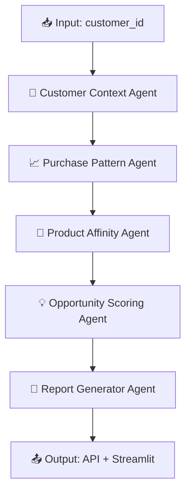

# 🤖 Customer 360° Recommender System

A modular AI-powered system that analyzes customer profiles, product usage, and behavioral signals to generate cross-sell and upsell opportunities — powered by **LangGraph**, **FastAPI**, **Streamlit**, and **Hugging Face Transformers**.


---

## 🔍 What This Project Does

This project uses a **LangGraph DAG** of AI agents to:
- 🧠 Understand customer context from a PostgreSQL database or CSV
- 📊 Analyze product usage and purchase history
- 🔁 Suggest related/co-purchased product opportunities
- 🎯 Score each opportunity based on business impact
- 📝 Generate a natural-language **research report**
- 🌐 Expose the entire pipeline via a **FastAPI endpoint**
- 💻 Provide a beautiful **Streamlit dashboard** for business users

---

## 🧱 Project Architecture


---

## 🚀 How to Run Locally

### 🔧 Setup
```bash
# 1. Clone repo and enter project
git clone https://github.com/yashdew3/langgraph-customer360-recommender.git
cd langgraph-customer360-recommender

# 2. Create virtual environment
python -m venv venv
source venv/bin/activate  # Windows: venv\Scripts\activate

# 3. Install dependencies
pip install -r requirements.txt
```
---

### 🧬 Start Backend API
```bash
uvicorn app.api:app --reload
```


### 💻 Start Streamlit Frontend
```bash
streamlit run streamlit_app.py
```


### 📂 Sample API Endpoint
Test in browser or Swagger UI:
```bash
http://localhost:8000/recommendation?customer_id=C001
```

Open Swagger Docs:
```bash
http://localhost:8000/docs
```
---

## 🧠 Features
- ✅ Modular agent system using LangGraph

- ✅ FastAPI-based REST interface

- ✅ PostgreSQL and CSV fallback support

- ✅ Real-time product affinity via Hugging Face

- ✅ Executive-ready research reports

- ✅ Interactive Streamlit UI for business teams

- ✅ Supports extension for new agents, LLMs, analytics

---

## 📊 Technologies Used

| Tech           | Purpose                       |
| -------------- | ----------------------------- |
| `LangGraph`    | Agent-based DAG orchestration |
| `FastAPI`      | RESTful API backend           |
| `Streamlit`    | Real-time frontend/dashboard  |
| `PostgreSQL`   | Structured customer database  |
| `Transformers` | Embedding and NLP scoring     |
| `Uvicorn`      | ASGI web server for FastAPI   |

---

## 🏗️ Folder Structure

```bash
├── app/
│   ├── agents/              # All 5 sub-agents
│   ├── db.py                # PostgreSQL interface
│   ├── dag.py               # LangGraph DAG pipeline
│   └── api.py               # FastAPI endpoint
│
├── data/                    # Sample CSV + SQL
│
├── dashboard/  
│   └── streamlit_app.py         # Streamlit frontend
│
├── requirements.txt
├── .gitignore
├── .env
└── LICENSCE

```
---

## ✅ Example Output
```json
{
  "executive_summary": "Edge Communications shows strong usage in Core Management Platform...",
  "recommendations": [
    {
      "product": "AI Insights Module",
      "score": 87,
      "rationale": "Related to Workflow Automation; High product usage..."
    }
  ]
}
```
---

## 🧪 Future Enhancements
- 🧾 PDF report export (via WeasyPrint or PDFKit)

- 🗃️ Add dynamic product catalog & segments

- 🧬 Integrate LangChain agents for richer LLM outputs

- ☁️ Deploy with Docker, CI/CD, or Streamlit Sharing
---

## 📄 License
MIT License © Yash Dewangan


## 💬 Let's Connect
Feel free to connect or suggest improvements!
- Built by **Yash Dewangan**
- 🐙Github: [YashDewangan](https://github.com/yashdew3)
- 📧Email: [yashdew06@gmail.com](mailto:yashdew06@gmail.com)
- 🔗Linkedin: [YashDewangan](https://www.linkedin.com/in/yash-dewangan/)

## 🤝 Contributing
Contributions, issues, and feature requests are welcome! Feel free to check the [issues page](https://github.com/yashdew3/langgraph-customer360-recommender/issues) (if you have one) or open a new issue to discuss changes. Pull requests are also appreciated.